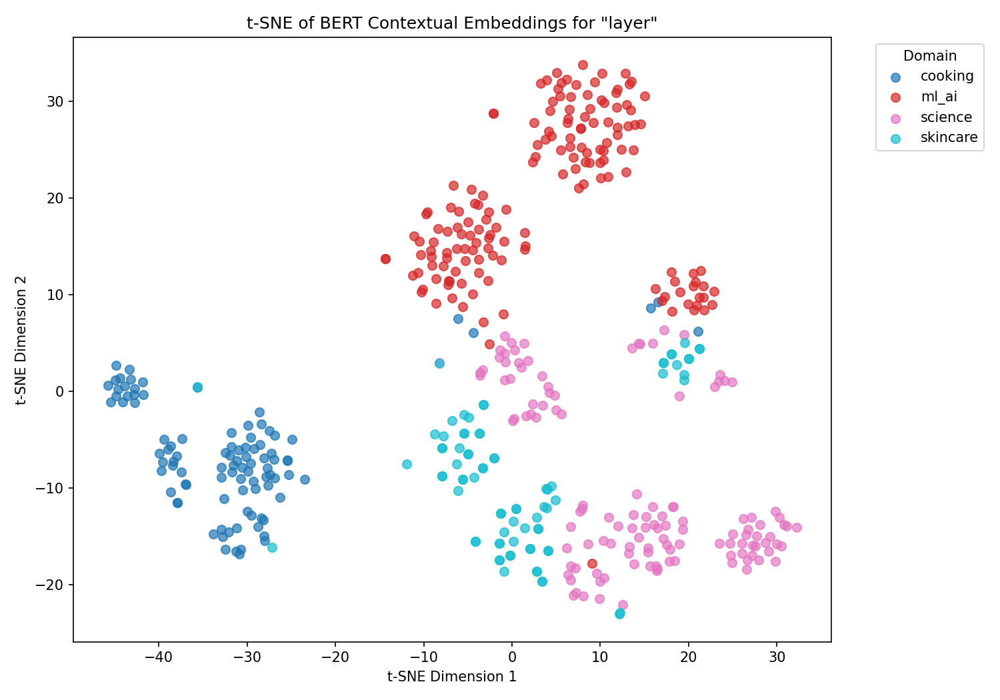

# Contextual Embeddings Explorer

Exploring how BERT's contextual embeddings capture word meaning differently depending on domain.

## Overview

This project investigates the polysemous word **"layer"** — a term that appears across ML/AI, science, cooking, and skincare — to visualize how BERT represents the same word differently based on context.

## What I did

- Collected 459 sentences from Wikipedia using its API, spanning four domains: ML/AI, Science, Cooking, and Skincare
- Extracted 768-dimensional contextual embeddings for each occurrence of "layer" using a pretrained BERT model
- Applied t-SNE dimensionality reduction to project embeddings into 2D for visualization
- Ran cosine similarity nearest-neighbor retrieval to confirm semantic separation across domains



## Key findings

- ML/AI sentences form a tight, isolated cluster driven by specialized vocabulary (*weights, attention, gradient*)
- Science and skincare domains overlap due to shared biological framing
- Nearest-neighbor analysis shows that neural network layer sentences consistently retrieve other ML sentences — despite the surface word being identical across all domains

## Setup

1. Clone the repo
2. Open `contextual-embeddings.ipynb` in Jupyter or VS Code
3. Run the first cell — it installs all dependencies into the notebook's Python environment:
   ```python
   import sys
   !{sys.executable} -m pip install -r requirements.txt
   ```
4. Run the remaining cells in order

## Stack

Python · PyTorch · HuggingFace Transformers · scikit-learn · t-SNE · Wikipedia API
